# Gijima WFM — UML Models

Diagrams derived from `01-REQUIREMENTS.md` (IDs in brackets trace back to it). Written in Mermaid so they render in GitHub, GitLab, Azure DevOps and the VS Code markdown preview.

Notation notes:
- Mermaid has no native use-case diagram, so use cases are drawn as flowcharts: `((Actor))` = actor, `([Use case])` = use case, boxes = system boundary, dotted arrows = «include» / «extend».
- The class diagrams are the **conceptual** domain model (what the business talks about), not the final database schema.

Contents
1. [System context](#1-system-context)
2. [Use cases](#2-use-cases)
3. [Domain model](#3-domain-model)
4. [State machines](#4-state-machines)
5. [Activity diagrams](#5-activity-diagrams)
6. [Sequence diagrams](#6-sequence-diagrams)
7. [Component and deployment](#7-component-and-deployment)

---

## 1. System context

Who and what the WFM system talks to. Dashed lines are integrations that come in Phase 6 (they need Gijima data feeds).

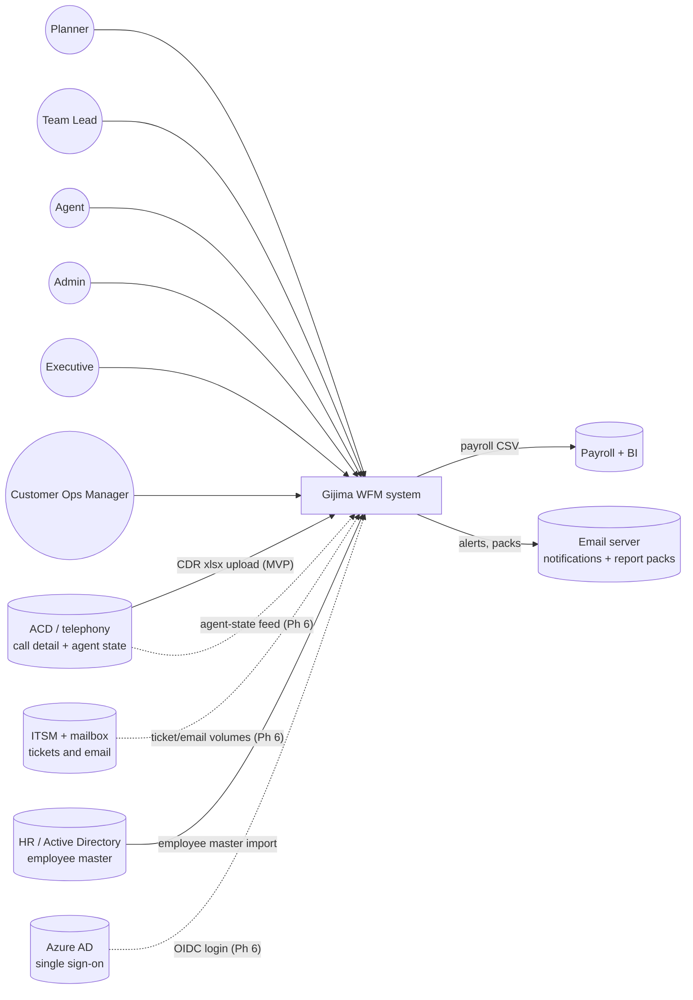
```mermaid
flowchart LR
    Planner((Planner))
    Lead((Team Lead))
    Agent((Agent))
    Admin((Admin))
    Exec((Executive))
    COM((Customer Ops Manager))

    WFM["Gijima WFM system"]

    ACD[("ACD / telephony<br/>call detail + agent state")]
    ITSM[("ITSM + mailbox<br/>tickets and email")]
    HR[("HR / Active Directory<br/>employee master")]
    AAD[("Azure AD<br/>single sign-on")]
    Payroll[("Payroll + BI")]
    Mail[("Email server<br/>notifications + report packs")]

    Planner --> WFM
    Lead --> WFM
    Agent --> WFM
    Admin --> WFM
    Exec --> WFM
    COM --> WFM

    ACD -- "CDR xlsx upload (MVP)" --> WFM
    ACD -. "agent-state feed (Ph 6)" .-> WFM
    ITSM -. "ticket/email volumes (Ph 6)" .-> WFM
    HR -- "employee master import" --> WFM
    AAD -. "OIDC login (Ph 6)" .-> WFM
    WFM -- "payroll CSV" --> Payroll
    WFM -- "alerts, packs" --> Mail
```

---

## 2. Use cases

### 2.1 Actor hierarchy

Roles are cumulative only where shown. Executive is read-only and does **not** inherit any write use case.

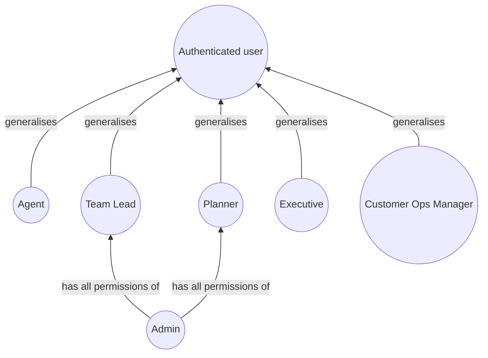
```mermaid
flowchart BT
    Agent((Agent))
    Lead((Team Lead))
    Planner((Planner))
    Admin((Admin))
    Exec((Executive))
    COM((Customer Ops Manager))
    User((Authenticated user))

    Agent -- generalises --> User
    Lead -- generalises --> User
    Planner -- generalises --> User
    Exec -- generalises --> User
    COM -- generalises --> User
    Admin -- "has all permissions of" --> Planner
    Admin -- "has all permissions of" --> Lead
```

### 2.2 Data, forecasting and requirement

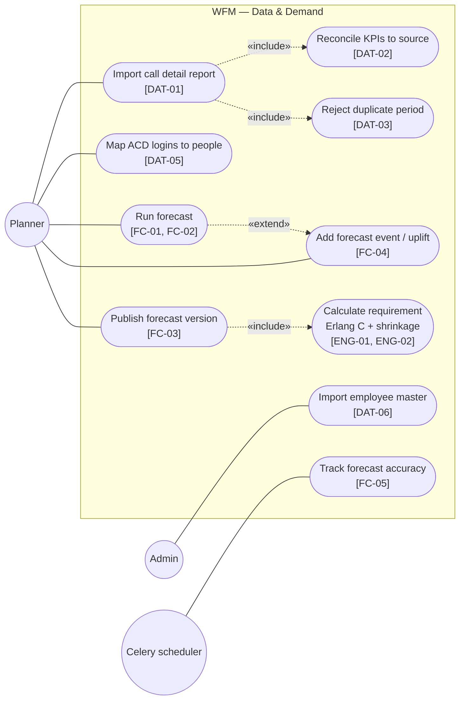
```mermaid
flowchart LR
    Planner((Planner))
    Admin((Admin))
    Scheduler((Celery scheduler))

    subgraph SYS["WFM — Data & Demand"]
        UC1(["Import call detail report<br/>[DAT-01]"])
        UC2(["Reconcile KPIs to source<br/>[DAT-02]"])
        UC3(["Reject duplicate period<br/>[DAT-03]"])
        UC4(["Map ACD logins to people<br/>[DAT-05]"])
        UC5(["Import employee master<br/>[DAT-06]"])
        UC6(["Run forecast<br/>[FC-01, FC-02]"])
        UC7(["Add forecast event / uplift<br/>[FC-04]"])
        UC8(["Publish forecast version<br/>[FC-03]"])
        UC9(["Calculate requirement<br/>Erlang C + shrinkage<br/>[ENG-01, ENG-02]"])
        UC10(["Track forecast accuracy<br/>[FC-05]"])
    end

    Planner --- UC1
    Planner --- UC4
    Planner --- UC6
    Planner --- UC7
    Planner --- UC8
    Admin --- UC5
    Scheduler --- UC10

    UC1 -. "«include»" .-> UC2
    UC1 -. "«include»" .-> UC3
    UC8 -. "«include»" .-> UC9
    UC6 -. "«extend»" .-> UC7
```

### 2.3 Planning and scheduling

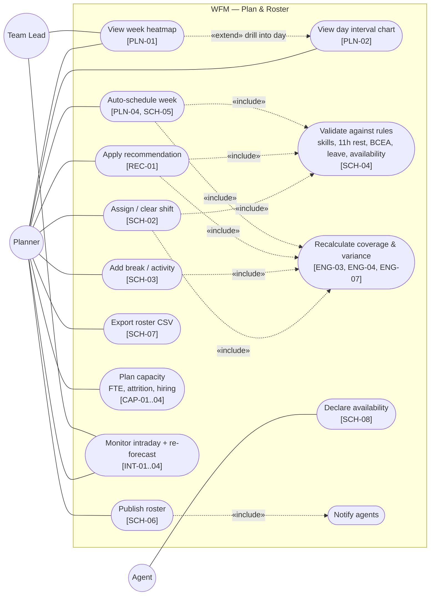
```mermaid
flowchart LR
    Planner((Planner))
    Lead((Team Lead))
    Agent((Agent))

    subgraph SYS["WFM — Plan & Roster"]
        P1(["View week heatmap<br/>[PLN-01]"])
        P2(["View day interval chart<br/>[PLN-02]"])
        P3(["Auto-schedule week<br/>[PLN-04, SCH-05]"])
        P4(["Assign / clear shift<br/>[SCH-02]"])
        P5(["Validate against rules<br/>skills, 11h rest, BCEA, leave, availability<br/>[SCH-04]"])
        P6(["Add break / activity<br/>[SCH-03]"])
        P7(["Apply recommendation<br/>[REC-01]"])
        P8(["Recalculate coverage & variance<br/>[ENG-03, ENG-04, ENG-07]"])
        P9(["Publish roster<br/>[SCH-06]"])
        P10(["Export roster CSV<br/>[SCH-07]"])
        P11(["Declare availability<br/>[SCH-08]"])
        P12(["Plan capacity<br/>FTE, attrition, hiring<br/>[CAP-01..04]"])
        P13(["Monitor intraday + re-forecast<br/>[INT-01..04]"])
        P14(["Notify agents"])
    end

    Planner --- P1
    Planner --- P2
    Planner --- P3
    Planner --- P4
    Planner --- P6
    Planner --- P7
    Planner --- P9
    Planner --- P10
    Planner --- P12
    Planner --- P13
    Lead --- P1
    Lead --- P13
    Agent --- P11

    P1 -. "«extend» drill into day" .-> P2
    P4 -. "«include»" .-> P5
    P4 -. "«include»" .-> P8
    P6 -. "«include»" .-> P8
    P7 -. "«include»" .-> P5
    P7 -. "«include»" .-> P8
    P3 -. "«include»" .-> P5
    P3 -. "«include»" .-> P8
    P9 -. "«include»" .-> P14
```

### 2.4 People: leave, swaps, overtime, self-service

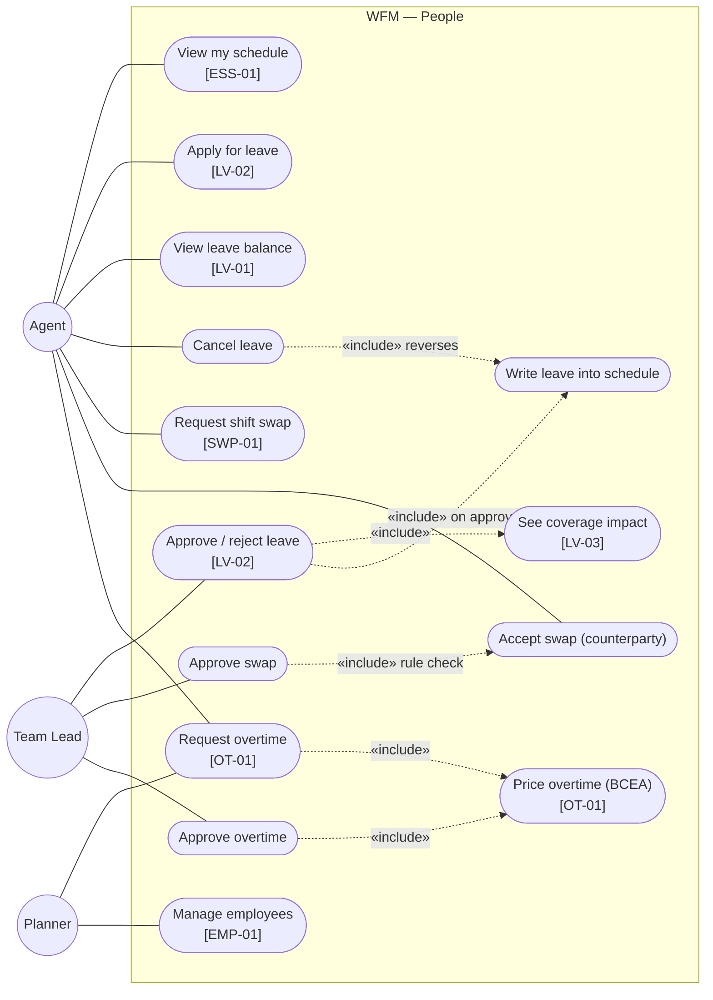
```mermaid
flowchart LR
    Agent((Agent))
    Lead((Team Lead))
    Planner((Planner))

    subgraph SYS["WFM — People"]
        L1(["View my schedule<br/>[ESS-01]"])
        L2(["Apply for leave<br/>[LV-02]"])
        L3(["View leave balance<br/>[LV-01]"])
        L4(["Approve / reject leave<br/>[LV-02]"])
        L5(["See coverage impact<br/>[LV-03]"])
        L6(["Cancel leave"])
        L7(["Write leave into schedule"])
        S1(["Request shift swap<br/>[SWP-01]"])
        S2(["Accept swap (counterparty)"])
        S3(["Approve swap"])
        O1(["Request overtime<br/>[OT-01]"])
        O2(["Approve overtime"])
        O3(["Price overtime (BCEA)<br/>[OT-01]"])
        E1(["Manage employees<br/>[EMP-01]"])
    end

    Agent --- L1
    Agent --- L2
    Agent --- L3
    Agent --- L6
    Agent --- S1
    Agent --- S2
    Agent --- O1
    Lead --- L4
    Lead --- S3
    Lead --- O2
    Planner --- O1
    Planner --- E1

    L4 -. "«include»" .-> L5
    L4 -. "«include» on approve" .-> L7
    L6 -. "«include» reverses" .-> L7
    S3 -. "«include» rule check" .-> S2
    O2 -. "«include»" .-> O3
    O1 -. "«include»" .-> O3
```

### 2.5 Insight and administration

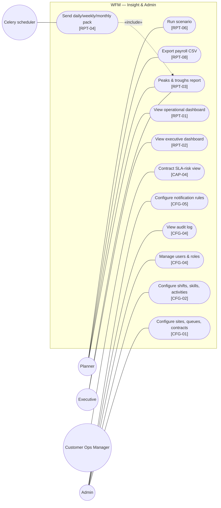
```mermaid
flowchart LR
    Planner((Planner))
    Exec((Executive))
    COM((Customer Ops Manager))
    Admin((Admin))
    Scheduler((Celery scheduler))

    subgraph SYS["WFM — Insight & Admin"]
        R1(["View operational dashboard<br/>[RPT-01]"])
        R2(["View executive dashboard<br/>[RPT-02]"])
        R3(["Peaks & troughs report<br/>[RPT-03]"])
        R4(["Send daily/weekly/monthly pack<br/>[RPT-04]"])
        R5(["Export payroll CSV<br/>[RPT-08]"])
        R6(["Contract SLA-risk view<br/>[CAP-04]"])
        R7(["Run scenario<br/>[RPT-06]"])
        A1(["Configure sites, queues, contracts<br/>[CFG-01]"])
        A2(["Configure shifts, skills, activities<br/>[CFG-02]"])
        A3(["Manage users & roles<br/>[CFG-04]"])
        A4(["View audit log<br/>[CFG-04]"])
        A5(["Configure notification rules<br/>[CFG-05]"])
    end

    Planner --- R1
    Planner --- R3
    Planner --- R5
    Planner --- R7
    Exec --- R2
    Exec --- R3
    COM --- R6
    Scheduler --- R4
    Admin --- A1
    Admin --- A2
    Admin --- A3
    Admin --- A4
    Admin --- A5

    R4 -. "«include»" .-> R3
```

### 2.6 Role × capability matrix

The use cases above reduce to this permission matrix. It is the source for the role-leak integration tests (tech spec §7). **R** = read, **W** = write, **own** = own records only, **team** = own team only.

| Capability | Agent | Team Lead | Planner | Admin | Executive | Cust. Ops Mgr |
|---|---|---|---|---|---|---|
| Own schedule, own leave, own swaps | R/W own | R/W own | R/W own | R/W own | — | — |
| Other people's schedules | — | R team | R/W | R/W | — | — |
| Leave / swap / overtime approval | — | W team | W | W | — | — |
| Imports, forecast, requirement | — | R | R/W | R/W | — | — |
| Planner, roster, recommendations, publish | — | R team | R/W | R/W | — | — |
| Capacity plan | — | — | R/W | R/W | R | R |
| Contract SLA-risk view | — | — | R | R | R | R (own contracts) |
| Dashboards, reports | — | R team | R | R | R (aggregates only) | R (own contracts) |
| Employee pay rates, overtime cost per person | — | — | R | R/W | — (aggregates only) | — |
| Configuration, users, audit log | — | — | — | R/W | — | — |

---

## 3. Domain model

### 3.1 Organisation and people

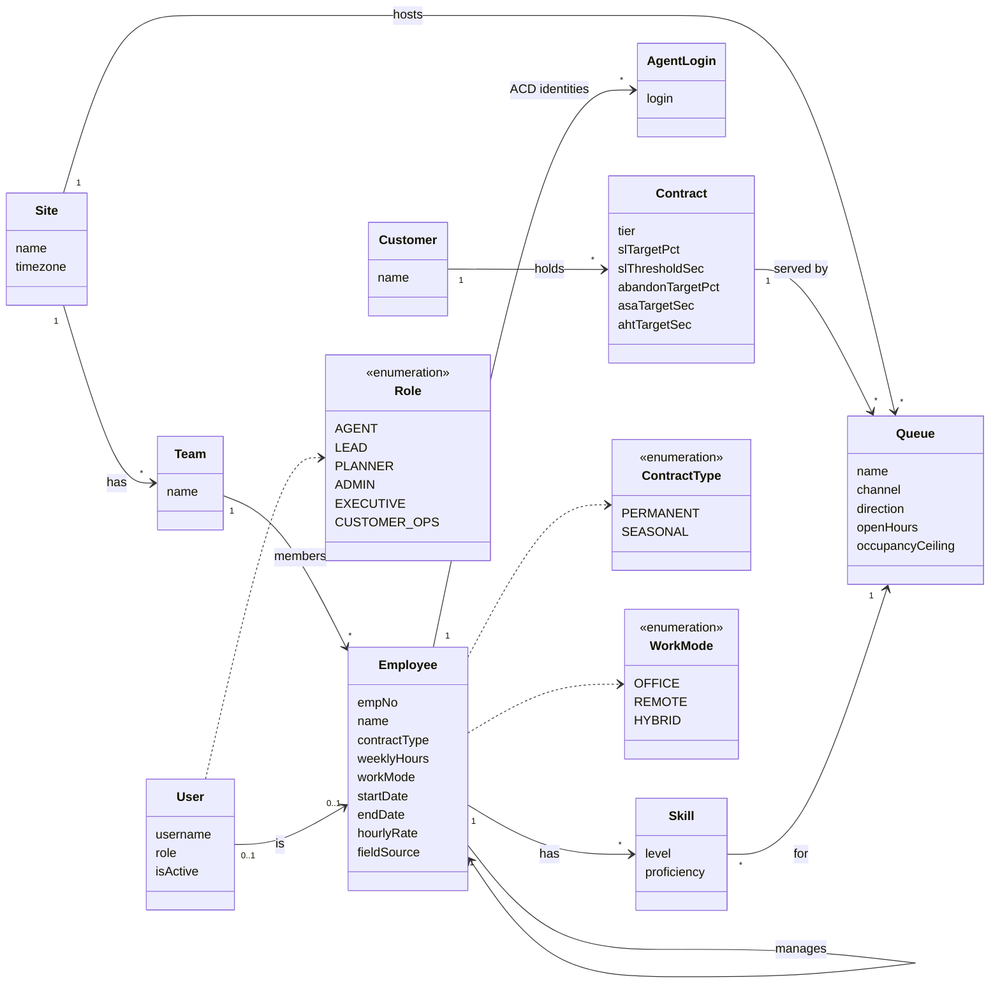
```mermaid
classDiagram
    direction LR
    class Site {
        name
        timezone
    }
    class Customer {
        name
    }
    class Contract {
        tier
        slTargetPct
        slThresholdSec
        abandonTargetPct
        asaTargetSec
        ahtTargetSec
    }
    class Queue {
        name
        channel
        direction
        openHours
        occupancyCeiling
    }
    class Team {
        name
    }
    class Employee {
        empNo
        name
        contractType
        weeklyHours
        workMode
        startDate
        endDate
        hourlyRate
        fieldSource
    }
    class AgentLogin {
        login
    }
    class Skill {
        level
        proficiency
    }
    class User {
        username
        role
        isActive
    }
    class ContractType {
        <<enumeration>>
        PERMANENT
        SEASONAL
    }
    class WorkMode {
        <<enumeration>>
        OFFICE
        REMOTE
        HYBRID
    }
    class Role {
        <<enumeration>>
        AGENT
        LEAD
        PLANNER
        ADMIN
        EXECUTIVE
        CUSTOMER_OPS
    }

    Site "1" --> "*" Queue : hosts
    Customer "1" --> "*" Contract : holds
    Contract "1" --> "*" Queue : served by
    Site "1" --> "*" Team : has
    Team "1" --> "*" Employee : members
    Employee "0..1" --> "*" Employee : manages
    Employee "1" --> "*" AgentLogin : ACD identities
    Employee "1" --> "*" Skill : has
    Skill "*" --> "1" Queue : for
    User "0..1" --> "0..1" Employee : is
    Employee ..> ContractType
    Employee ..> WorkMode
    User ..> Role
```

### 3.2 Demand: calls, forecast, requirement

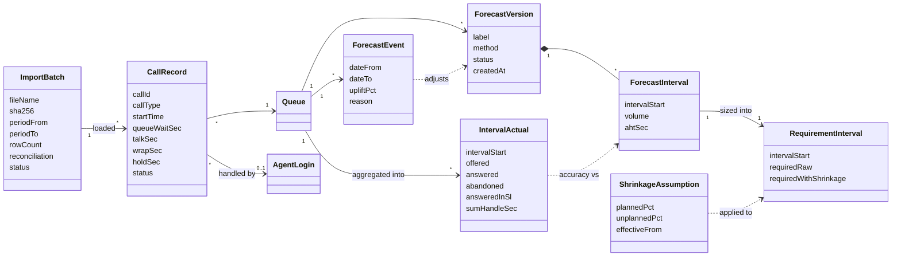
```mermaid
classDiagram
    direction LR
    class ImportBatch {
        fileName
        sha256
        periodFrom
        periodTo
        rowCount
        reconciliation
        status
    }
    class CallRecord {
        callId
        callType
        startTime
        queueWaitSec
        talkSec
        wrapSec
        holdSec
        status
    }
    class IntervalActual {
        intervalStart
        offered
        answered
        abandoned
        answeredInSl
        sumHandleSec
    }
    class ForecastVersion {
        label
        method
        status
        createdAt
    }
    class ForecastInterval {
        intervalStart
        volume
        ahtSec
    }
    class ForecastEvent {
        dateFrom
        dateTo
        upliftPct
        reason
    }
    class ShrinkageAssumption {
        plannedPct
        unplannedPct
        effectiveFrom
    }
    class RequirementInterval {
        intervalStart
        requiredRaw
        requiredWithShrinkage
    }
    class Queue

    ImportBatch "1" --> "*" CallRecord : loaded
    CallRecord "*" --> "1" Queue
    CallRecord "*" --> "0..1" AgentLogin : handled by
    Queue "1" --> "*" IntervalActual : aggregated into
    Queue "1" --> "*" ForecastVersion
    ForecastVersion "1" *-- "*" ForecastInterval
    Queue "1" --> "*" ForecastEvent
    ForecastEvent ..> ForecastVersion : adjusts
    ForecastInterval "1" --> "1" RequirementInterval : sized into
    ShrinkageAssumption ..> RequirementInterval : applied to
    IntervalActual ..> ForecastInterval : accuracy vs
```

### 3.3 Schedule and time off

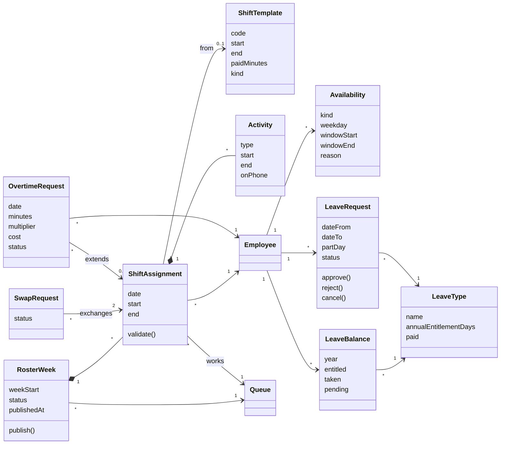
```mermaid
classDiagram
    direction LR
    class ShiftTemplate {
        code
        start
        end
        paidMinutes
        kind
    }
    class RosterWeek {
        weekStart
        status
        publishedAt
        publish()
    }
    class ShiftAssignment {
        date
        start
        end
        validate()
    }
    class Activity {
        type
        start
        end
        onPhone
    }
    class Availability {
        kind
        weekday
        windowStart
        windowEnd
        reason
    }
    class LeaveType {
        name
        annualEntitlementDays
        paid
    }
    class LeaveBalance {
        year
        entitled
        taken
        pending
    }
    class LeaveRequest {
        dateFrom
        dateTo
        partDay
        status
        approve()
        reject()
        cancel()
    }
    class SwapRequest {
        status
    }
    class OvertimeRequest {
        date
        minutes
        multiplier
        cost
        status
    }
    class Employee
    class Queue

    RosterWeek "1" *-- "*" ShiftAssignment
    RosterWeek "*" --> "1" Queue
    ShiftAssignment "*" --> "1" Employee
    ShiftAssignment "*" --> "0..1" ShiftTemplate : from
    ShiftAssignment "*" --> "1" Queue : works
    ShiftAssignment "1" *-- "*" Activity
    Employee "1" --> "*" Availability
    Employee "1" --> "*" LeaveBalance
    LeaveBalance "*" --> "1" LeaveType
    Employee "1" --> "*" LeaveRequest
    LeaveRequest "*" --> "1" LeaveType
    SwapRequest "*" --> "2" ShiftAssignment : exchanges
    OvertimeRequest "*" --> "1" Employee
    OvertimeRequest "*" --> "0..1" ShiftAssignment : extends
```

### 3.4 Audit and notification (cross-cutting)

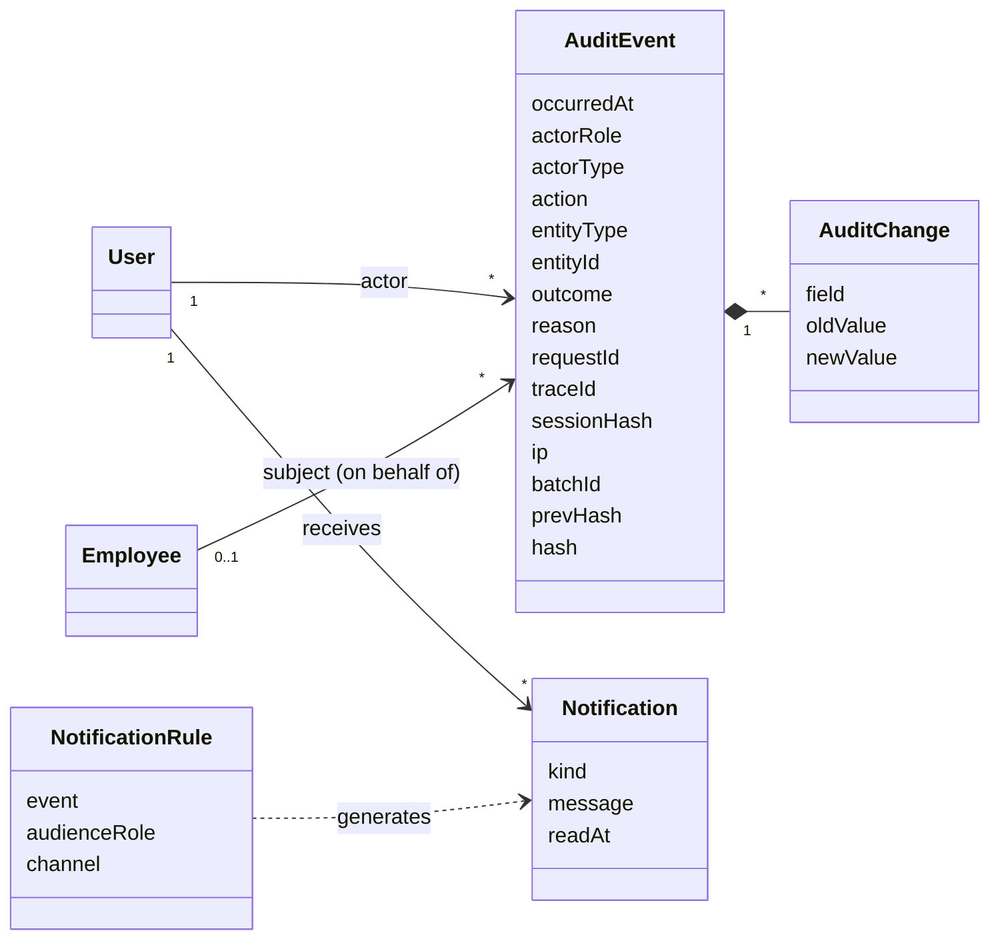
```mermaid
classDiagram
    direction LR
    class AuditEvent {
        occurredAt
        actorRole
        actorType
        action
        entityType
        entityId
        outcome
        reason
        requestId
        traceId
        sessionHash
        ip
        batchId
        prevHash
        hash
    }
    class AuditChange {
        field
        oldValue
        newValue
    }
    class Notification {
        kind
        message
        readAt
    }
    class NotificationRule {
        event
        audienceRole
        channel
    }
    class User
    User "1" --> "*" AuditEvent : actor
    Employee "0..1" --> "*" AuditEvent : subject (on behalf of)
    AuditEvent "1" *-- "*" AuditChange
    User "1" --> "*" Notification : receives
    NotificationRule ..> Notification : generates
```

---

## 4. State machines

### 4.1 Roster week [SCH-06]

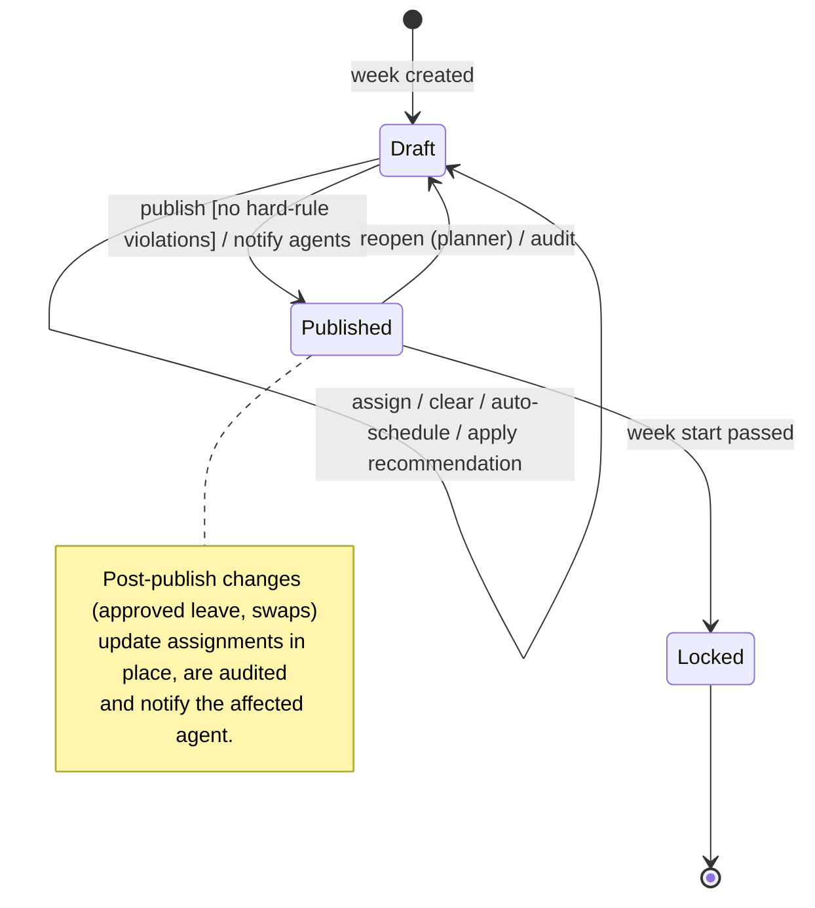
```mermaid
stateDiagram-v2
    [*] --> Draft : week created
    Draft --> Draft : assign / clear / auto-schedule / apply recommendation
    Draft --> Published : publish [no hard-rule violations] / notify agents
    Published --> Draft : reopen (planner) / audit
    Published --> Locked : week start passed
    Locked --> [*]
    note right of Published
        Post-publish changes (approved leave, swaps)
        update assignments in place, are audited
        and notify the affected agent.
    end note
```

### 4.2 Leave request [LV-02, LV-03]

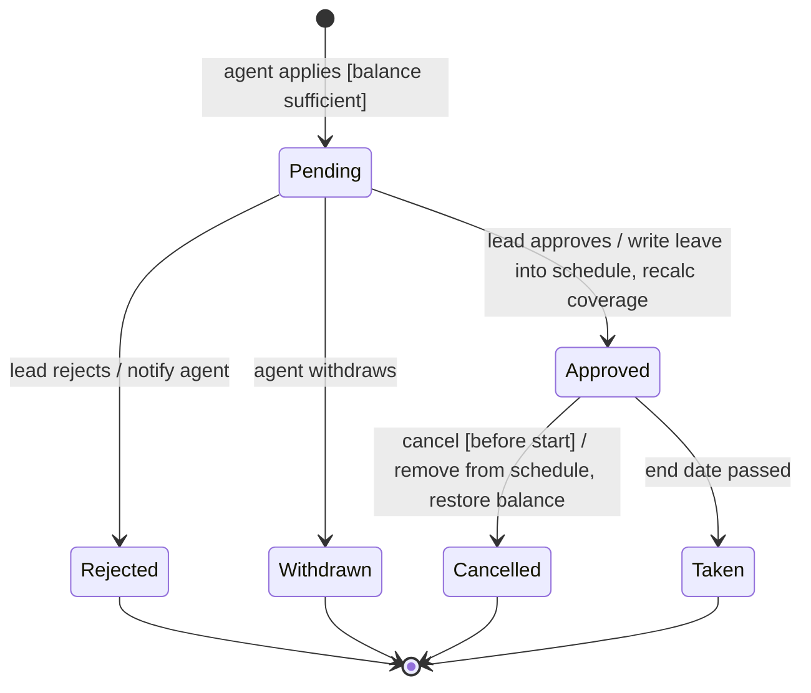
```mermaid
stateDiagram-v2
    [*] --> Pending : agent applies [balance sufficient]
    Pending --> Approved : lead approves / write leave into schedule, recalc coverage
    Pending --> Rejected : lead rejects / notify agent
    Pending --> Withdrawn : agent withdraws
    Approved --> Cancelled : cancel [before start] / remove from schedule, restore balance
    Approved --> Taken : end date passed
    Rejected --> [*]
    Withdrawn --> [*]
    Cancelled --> [*]
    Taken --> [*]
```

### 4.3 Shift swap [SWP-01]

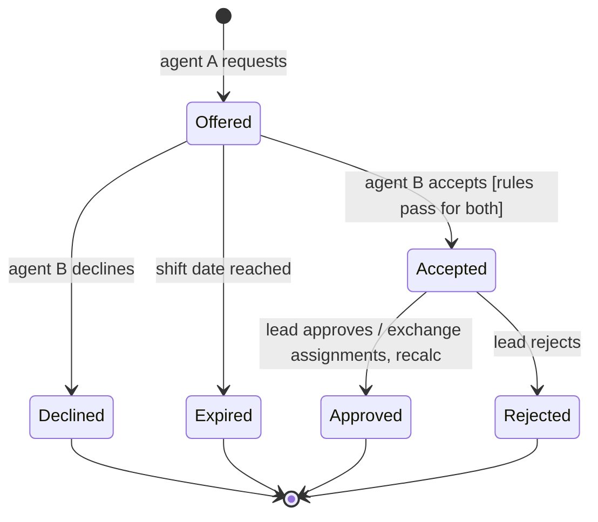
```mermaid
stateDiagram-v2
    [*] --> Offered : agent A requests
    Offered --> Accepted : agent B accepts [rules pass for both]
    Offered --> Declined : agent B declines
    Offered --> Expired : shift date reached
    Accepted --> Approved : lead approves / exchange assignments, recalc
    Accepted --> Rejected : lead rejects
    Declined --> [*]
    Expired --> [*]
    Approved --> [*]
    Rejected --> [*]
```

### 4.4 Overtime request [OT-01, OT-03]

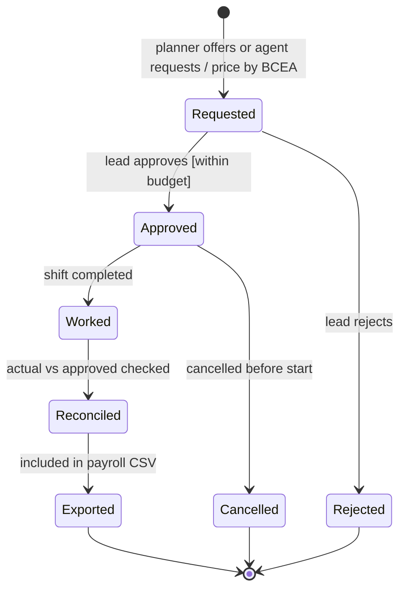
```mermaid
stateDiagram-v2
    [*] --> Requested : planner offers or agent requests / price by BCEA
    Requested --> Approved : lead approves [within budget]
    Requested --> Rejected : lead rejects
    Approved --> Worked : shift completed
    Approved --> Cancelled : cancelled before start
    Worked --> Reconciled : actual vs approved checked
    Reconciled --> Exported : included in payroll CSV
    Exported --> [*]
    Rejected --> [*]
    Cancelled --> [*]
```

### 4.5 Forecast version [FC-03]

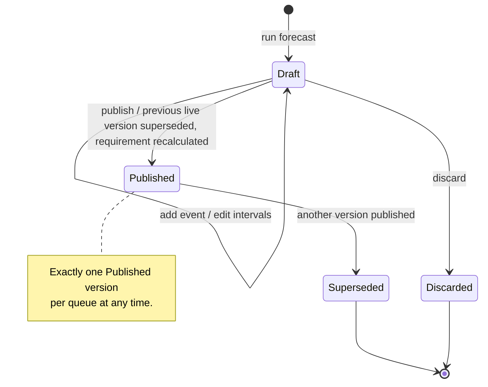
```mermaid
stateDiagram-v2
    [*] --> Draft : run forecast
    Draft --> Draft : add event / edit intervals
    Draft --> Published : publish / previous live version superseded, requirement recalculated
    Published --> Superseded : another version published
    Draft --> Discarded : discard
    Superseded --> [*]
    Discarded --> [*]
    note right of Published
        Exactly one Published version
        per queue at any time.
    end note
```

### 4.6 Import batch [DAT-01..03]

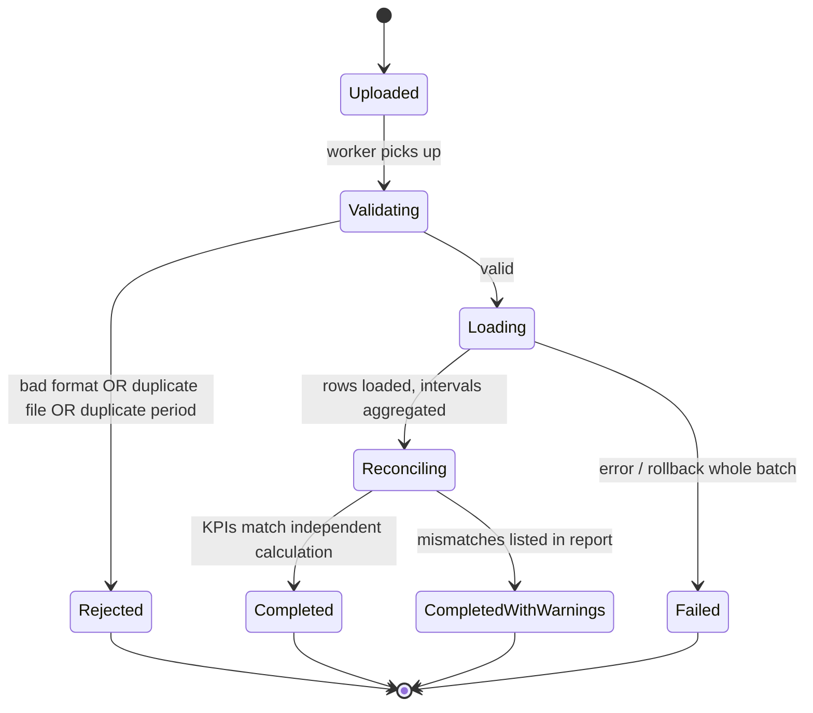
```mermaid
stateDiagram-v2
    [*] --> Uploaded
    Uploaded --> Validating : worker picks up
    Validating --> Rejected : bad format OR duplicate file OR duplicate period
    Validating --> Loading : valid
    Loading --> Reconciling : rows loaded, intervals aggregated
    Reconciling --> Completed : KPIs match independent calculation
    Reconciling --> CompletedWithWarnings : mismatches listed in report
    Loading --> Failed : error / rollback whole batch
    Completed --> [*]
    CompletedWithWarnings --> [*]
    Rejected --> [*]
    Failed --> [*]
```

---

## 5. Activity diagrams

### 5.1 End-to-end planning cycle

The weekly loop the whole product exists to support.

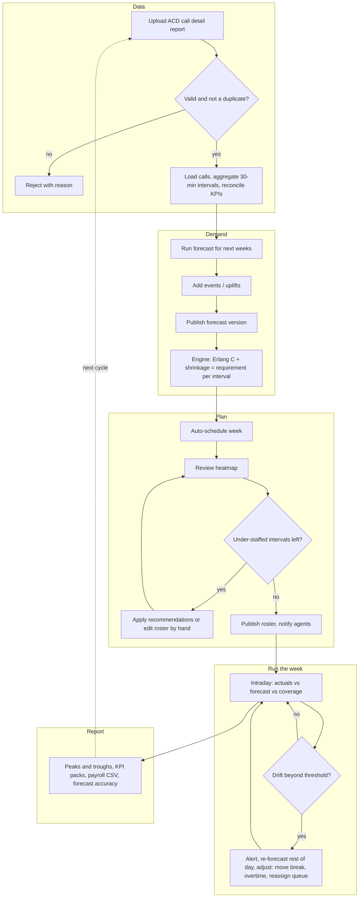
```mermaid
flowchart TB
    subgraph Data["Data"]
        A1["Upload ACD call detail report"] --> A2{"Valid and not a duplicate?"}
        A2 -- no --> A3["Reject with reason"]
        A2 -- yes --> A4["Load calls, aggregate 30-min intervals, reconcile KPIs"]
    end
    subgraph Demand["Demand"]
        B1["Run forecast for next weeks"] --> B2["Add events / uplifts"]
        B2 --> B3["Publish forecast version"]
        B3 --> B4["Engine: Erlang C + shrinkage = requirement per interval"]
    end
    subgraph Plan["Plan"]
        C1["Auto-schedule week"] --> C2["Review heatmap"]
        C2 --> C3{"Under-staffed intervals left?"}
        C3 -- yes --> C4["Apply recommendations or edit roster by hand"]
        C4 --> C2
        C3 -- no --> C5["Publish roster, notify agents"]
    end
    subgraph Run["Run the week"]
        D1["Intraday: actuals vs forecast vs coverage"] --> D2{"Drift beyond threshold?"}
        D2 -- yes --> D3["Alert, re-forecast rest of day, adjust: move break, overtime, reassign queue"]
        D3 --> D1
        D2 -- no --> D1
    end
    subgraph Report["Report"]
        E1["Peaks and troughs, KPI packs, payroll CSV, forecast accuracy"]
    end
    A4 --> B1
    B4 --> C1
    C5 --> D1
    D1 --> E1
    E1 -. "next cycle" .-> A1
```

### 5.2 Leave approval with coverage impact

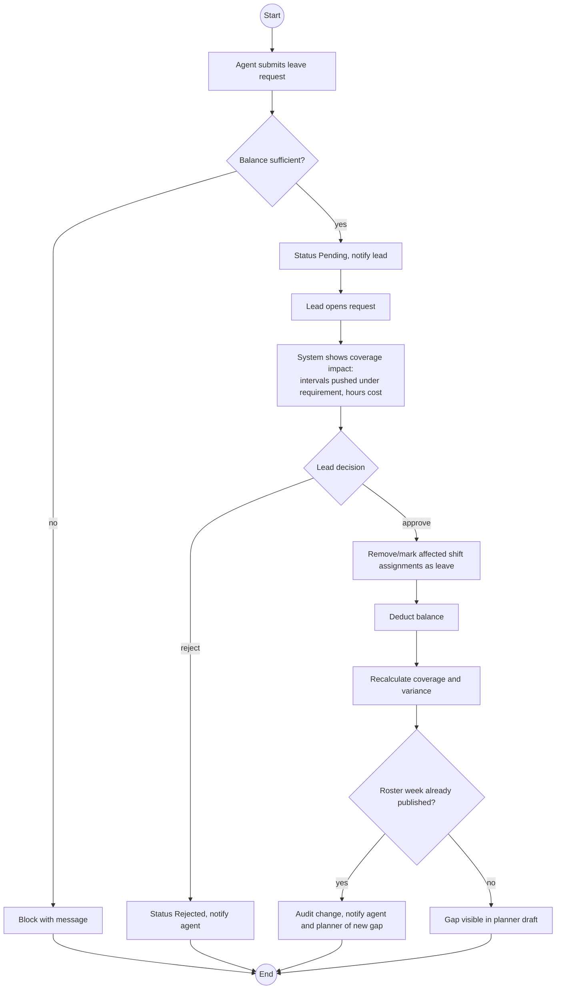
```mermaid
flowchart TB
    S((Start)) --> A["Agent submits leave request"]
    A --> B{"Balance sufficient?"}
    B -- no --> B1["Block with message"] --> X((End))
    B -- yes --> C["Status Pending, notify lead"]
    C --> D["Lead opens request"]
    D --> E["System shows coverage impact:<br/>intervals pushed under requirement, hours cost"]
    E --> F{"Lead decision"}
    F -- reject --> G["Status Rejected, notify agent"] --> X
    F -- approve --> H["Remove/mark affected shift assignments as leave"]
    H --> I["Deduct balance"]
    I --> J["Recalculate coverage and variance"]
    J --> K{"Roster week already published?"}
    K -- yes --> L["Audit change, notify agent and planner of new gap"]
    K -- no --> M["Gap visible in planner draft"]
    L --> X
    M --> X
```

### 5.3 Assigning a shift (validation rules) [SCH-04]

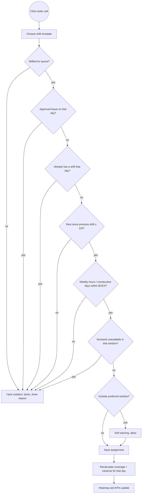
```mermaid
flowchart TB
    S((Click roster cell)) --> A["Choose shift template"]
    A --> R1{"Skilled for queue?"}
    R1 -- no --> H["Hard violation: block, show reason"]
    R1 -- yes --> R2{"Approved leave on that day?"}
    R2 -- yes --> H
    R2 -- no --> R3{"Already has a shift that day?"}
    R3 -- yes --> H
    R3 -- no --> R4{"Rest since previous shift ≥ 11h?"}
    R4 -- no --> H
    R4 -- yes --> R5{"Weekly hours / consecutive days within BCEA?"}
    R5 -- no --> H
    R5 -- yes --> R6{"Declared unavailable in that window?"}
    R6 -- yes --> H
    R6 -- no --> R7{"Outside preferred window?"}
    R7 -- yes --> W["Soft warning, allow"]
    R7 -- no --> OK["Save assignment"]
    W --> OK
    OK --> RC["Recalculate coverage + variance for that day"]
    RC --> UI["Heatmap and KPIs update"]
```

---

## 6. Sequence diagrams

### 6.1 Import call detail report [DAT-01..04]

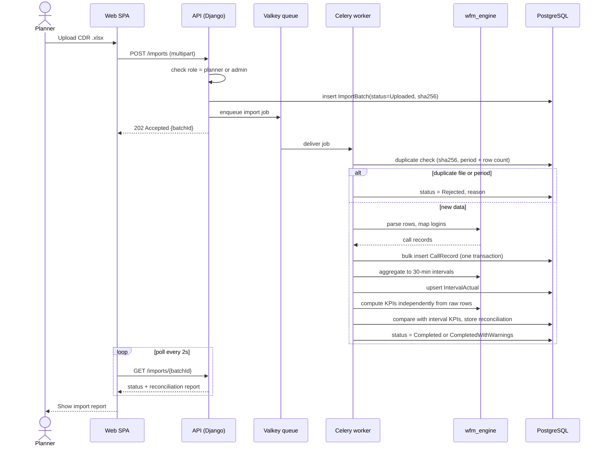
```mermaid
sequenceDiagram
    actor P as Planner
    participant W as Web SPA
    participant A as API (Django)
    participant Q as Valkey queue
    participant K as Celery worker
    participant E as wfm_engine
    participant D as PostgreSQL

    P->>W: Upload CDR .xlsx
    W->>A: POST /imports (multipart)
    A->>A: check role = planner or admin
    A->>D: insert ImportBatch(status=Uploaded, sha256)
    A->>Q: enqueue import job
    A-->>W: 202 Accepted {batchId}
    Q->>K: deliver job
    K->>D: duplicate check (sha256, period + row count)
    alt duplicate file or period
        K->>D: status = Rejected, reason
    else new data
        K->>E: parse rows, map logins
        E-->>K: call records
        K->>D: bulk insert CallRecord (one transaction)
        K->>E: aggregate to 30-min intervals
        K->>D: upsert IntervalActual
        K->>E: compute KPIs independently from raw rows
        K->>D: compare with interval KPIs, store reconciliation
        K->>D: status = Completed or CompletedWithWarnings
    end
    loop poll every 2s
        W->>A: GET /imports/{batchId}
        A-->>W: status + reconciliation report
    end
    W-->>P: Show import report
```

### 6.2 Assign a shift with live recalculation [SCH-02, SCH-04, ENG-07]

```mermaid
sequenceDiagram
    actor P as Planner
    participant W as Web SPA
    participant A as API (Django)
    participant R as Rule checker (wfm_engine)
    participant C as Coverage calc (wfm_engine)
    participant D as PostgreSQL

    P->>W: Click cell (Devon Foster, Tue) choose D1
    W->>A: POST /roster/assign {employee, date, template, queue}
    A->>A: check role and that the queue is in user scope
    A->>D: load employee skills, leave, availability, adjacent shifts
    A->>R: validate(assignment, context)
    alt hard violation
        R-->>A: violations[]
        A-->>W: 422 {violations}
        W-->>P: Show reason, cell unchanged
    else ok or soft warnings
        R-->>A: warnings[]
        A->>D: save ShiftAssignment + audit entry
        A->>D: load requirement + assignments for that day
        A->>C: coverage and variance per interval
        C-->>A: 48 intervals
        A-->>W: 200 {assignment, warnings, dayIntervals, kpis}
        W-->>P: Cell shows D1, heatmap column and KPIs update
    end
```

### 6.3 Approve leave [LV-02, LV-03]

```mermaid
sequenceDiagram
    actor L as Team Lead
    participant W as Web SPA
    participant A as API (Django)
    participant C as Coverage calc
    participant D as PostgreSQL
    participant N as Notifications

    L->>W: Open pending request
    W->>A: GET /leave/{id}/impact
    A->>A: request belongs to lead's team?
    A->>C: coverage with and without the agent
    C-->>A: intervals newly short, hours
    A-->>W: impact
    L->>W: Approve
    W->>A: POST /leave/{id}/approve
    A->>D: BEGIN
    A->>D: leave status = Approved
    A->>D: mark/remove affected ShiftAssignments
    A->>D: deduct LeaveBalance
    A->>D: audit entries
    A->>D: COMMIT
    A->>N: notify agent (approved), planner (new gap if roster published)
    A-->>W: 200 {leave, coverageDelta}
```

### 6.4 Auto-schedule week [PLN-04, SCH-05]

```mermaid
sequenceDiagram
    actor P as Planner
    participant W as Web SPA
    participant A as API (Django)
    participant K as Celery worker
    participant O as Optimiser (OR-Tools CP-SAT)
    participant D as PostgreSQL

    P->>W: Auto-schedule week
    W->>A: POST /planner/auto-schedule {queue, week}
    A->>A: roster week is Draft?
    A-->>W: 202 {jobId}
    A->>K: enqueue
    K->>D: load requirement, employees, skills, leave, availability, templates, rules
    K->>O: build model (hard constraints + weighted objective)
    O-->>K: best solution within time limit
    K->>D: replace draft assignments (one transaction) + audit
    K->>D: job result {gapBefore, gapAfter, unfilled}
    W->>A: GET /jobs/{jobId}
    A-->>W: done + summary
    W-->>P: Heatmap reloads, summary toast
```

### 6.5 Role-scoped data access (no cross-role leakage)

Every read goes through one scoping layer, so a role cannot see rows outside its scope even if the UI is bypassed.

```mermaid
sequenceDiagram
    actor U as Any user
    participant W as Web SPA
    participant M as Auth middleware (Django)
    participant V as API endpoint
    participant S as Scoped queryset (per model)
    participant D as PostgreSQL

    U->>W: Navigate to Leave
    W->>M: GET /leave (session cookie)
    M->>M: resolve user, role, employee, team, contracts
    M->>V: request.user
    V->>V: endpoint permission check (role allowed?)
    alt role not allowed
        V-->>W: 403
    else allowed
        V->>S: LeaveRequest.objects.for_user(user)
        alt agent
            S->>D: WHERE employee_id = me
        else team lead
            S->>D: WHERE employee.team_id = my team
        else planner or admin
            S->>D: no row filter
        else executive
            S->>D: aggregate only, no per-person rows
        end
        D-->>S: rows
        S-->>V: rows
        V->>V: serialise with role-specific schema (e.g. hide pay rates)
        V-->>W: 200
    end
```

---

## 7. Component and deployment

### 7.1 Components

```mermaid
flowchart LR
    subgraph Browser
        SPA["Web SPA<br/>Vue 3 + TypeScript"]
    end
    subgraph API["Django project (api)"]
        AUTH["accounts<br/>users, roles, scoping"]
        ORG["org<br/>sites, queues, contracts, teams"]
        PPL["people<br/>employees, skills, availability"]
        FC["forecasting<br/>versions, events, requirement"]
        SCH["scheduling<br/>roster, templates, activities, recommendations"]
        LV["leave<br/>types, balances, requests, swaps"]
        OT["overtime<br/>requests, standby, pricing"]
        IMP["imports<br/>CDR, employee master"]
        RPT["reporting<br/>dashboards, packs, exports"]
        AUD["audit<br/>simple-history"]
    end
    subgraph ENG["wfm_engine (pure Python)"]
        E1["erlang"]
        E2["forecast"]
        E3["rules (BCEA, rest, skills)"]
        E4["coverage + variance"]
        E5["optimiser (OR-Tools)"]
        E6["kpi"]
    end
    WK["Celery worker"]
    DB[("PostgreSQL")]
    VK[("Valkey")]

    SPA -- "JSON / OpenAPI" --> API
    FC --> E1
    FC --> E2
    SCH --> E3
    SCH --> E4
    SCH --> E5
    RPT --> E6
    IMP --> E6
    API --> DB
    API --> VK
    VK --> WK
    WK --> ENG
    WK --> DB
```

### 7.2 Deployment (production, Azure South Africa North)

```mermaid
flowchart TB
    U["Users' browsers"] -- HTTPS --> GW["Reverse proxy / TLS<br/>(nginx or Azure Front Door)"]
    subgraph VNet["Azure VNet — South Africa North (single tenant)"]
        GW --> WEB["Static SPA files"]
        GW --> APP["Django app container<br/>gunicorn"]
        APP --> PG[("Azure Database for PostgreSQL<br/>encrypted, daily backup")]
        APP --> VK[("Valkey container")]
        WRK["Celery worker container"] --> PG
        WRK --> VK
        BEAT["Celery beat (scheduled packs, accuracy)"] --> VK
    end
    APP -. OIDC .-> AAD["Azure AD"]
    WRK -. SMTP .-> MAIL["Email relay"]
    WRK -. "SFTP / API (Ph 6)" .-> SRC["Gijima ACD, ITSM, HR"]
```
